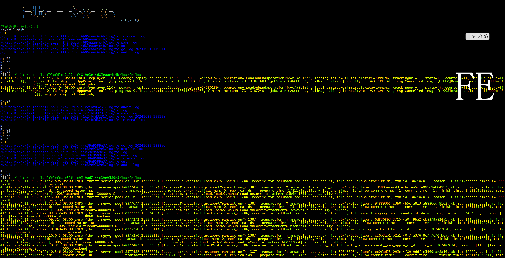
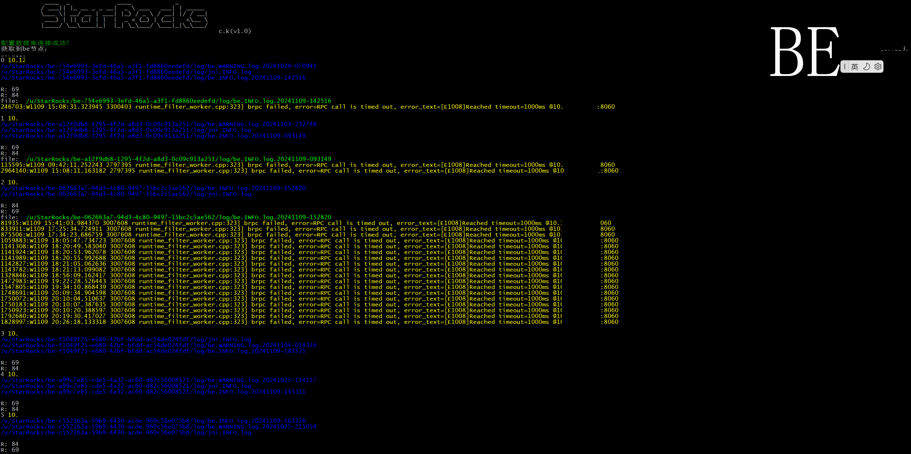
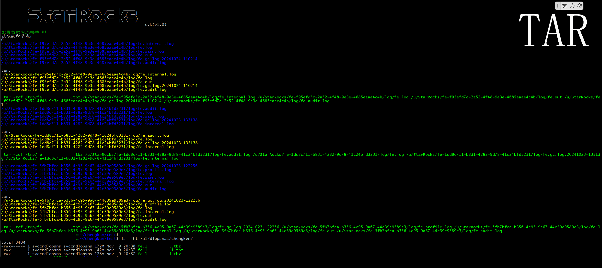
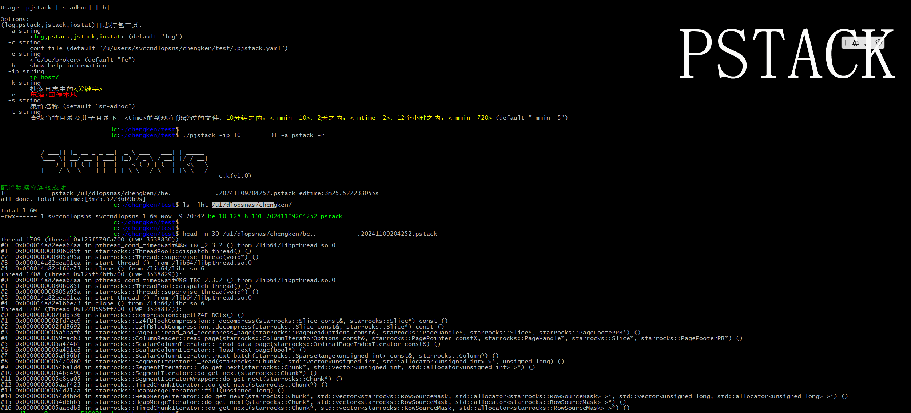

# StarRocks日志搜索工具

## Support

```
用于日常查看所有StarRocks节点FE,BE,BROKER服务日志、IOStat、Pstack堆栈、Jstack堆栈，打包，压缩，回传。

工具需要做到当前机器免密访问到StarRocks节点（可使用公钥私钥[在配置文件中]）

这里面需要一个MySQL表，由于就是SSH没什么技术含量，不做过多介绍
```
从【所有FE】或【固定FE】节点中搜索“关键字”日志(-k "关键字" -e fe)

从【所有BE】或【固定BE】节点中搜索“关键字”日志(-k "关键字" -e be)

从【所有FE/BE】或【固定FE/BE】中压缩打包好日志文件拉回本地

从【所有FE/BE】或【固定FE/BE】中打一个pstack/jstack并把日志拉回本地


